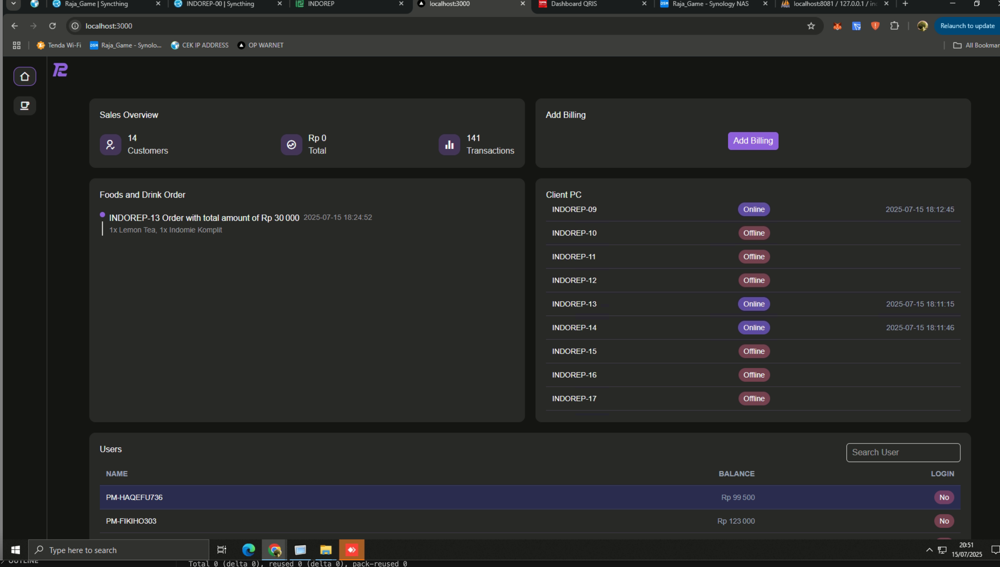

# Jobdesk OP Warnet - INDOREP NET [15-Juli-2025]

## 1. Pengawasan penuh pada area Warnet!
- Lakukan pengawasan secara aktif terhadap seluruh area warnet, termasuk aktivitas keluar-masuk pelanggan serta individu yang berada di dalam area warnet
- Pastikan untuk memperhatikan pelanggan yang telah menyelesaikan sesi billing dan bersiap meninggalkan area, guna memastikan keamanan serta kelengkapan fasilitas yang digunakan.

## 2. Pelayanan Transaksi
- Selalu bersikap ramah, dan tawarkan paket yang worth seperti paket bocah dan paket levelling
- Menerima pembayaran billing warnet (Cash & QRIS)
- Menerima pembayaran produk (minuman dingin) (Cash & QRIS)

## 3. Kebersihan & Kerapian
Dilakukan segera setelah customer selesai menggunakan PC:
- Merapikan monitor, PC, keyboard, mousepad, mouse, headset
- Mengelap meja
- Menata kembali tisu ke tempat asal
- Antarkan alat makan ke lantai 1 jika luang

## 3. Pemeliharaan Sistem
- Menjalankan update game setiap hari pukul 05:00 WIB (lihat SOP Update Game)

# SOP OP Warnet - Penggunaan Billing

- Pada halaman billing, gunakan tombol add billing di atas kanan untuk menambah pelanggan baru / belum punya akun. Kolom username, tanyakan pada pelanggan mau diisi apa, dan password set saja 1234.

- Untuk menambahkan saldo pada user yang sudah pernah terdaftar, terdapat area pada bagian bawah yaitu Users. Petugas OP dapat search username pelanggan, lalu klik username tersebut. History dan dialog untuk menambah biaya billing akan muncul.

# SOP OP Warnet - Update Game INDOREP NET

## Pengenalan Software yang digunakan oleh OP Warnet
- Reboot Restore RX. Digunakan untuk management PC.

- Billing Utama INDOREP (localhost:3000). Digunakan untuk membuat manajemen menambah billing user baru maupun mengisi billing yang sudah ada

- Billing Hijau (iCafeCloud). Digunakan untuk backup ketika billing INDOERP tidak berfungsi

- Syncthing INDOREP-00(localhost:8384). Digunakan untuk manajemen update game dari PC Server menuju PC Server NAS

- Syncthing Raja_Game(192.168.5.61:8384). Digunakan untuk manajemen update game dari NAS Server menuju PC Client

## Priority List

### 🔴 [High Priority] — Check Daily (1x/day)
- Valorant (Riot)
- League of Legends (Riot)
- Point Blank
- DOTA 2 (Steam)
- Counter-Strike 2 (Steam)
- PUBG (Steam)

### 🟠 [Medium Priority] — Check Weekly (1x/week)
- Genshin Impact (HoYoLauncher)
- Honkai Star Rail (HoYoLauncher)
- Honkai Impact (HoYoLauncher)
- ZZZ (Hoyo Launcher)
- Wuthering Waves
- The Finals (Steam)
- Apex Legends (Steam)
- Delta Force (Steam)
- AyoDance

### 🟢 [Low Priority] — Check Biweekly or Less (1x/2 weeks or more)
- Roblox
- FiveM
- GTA V Legacy (Steam)
- Growtopia (Steam)
- Among Us (Steam)
- Buckshot Roulette (Steam)
- Fall Guys (Steam)
- Phasmophobia (Steam)

---

## 1. PC Operator Side

### 🔴 High Priority
- Buka Riot Client, update Valorant & LOL
- Buka D:\Apps\Point Blank\PBLauncher.exe, update Point Blank
- Buka Steam, update semua game high priority
- Cek Syncthing (INDOREP-00) di [http://localhost:8384/](http://localhost:8384/), pastikan sudah up-to-date semua
- Cek progress folder Apps, Riot & steamapps, pastikan sudah up to date emua

### 🟠 Medium Priority
- Buka Steam, update semua game medium priority
- Navigasi ke `D:\Apps\AyoDance`, update AyoDance
- Navigasi ke `D:\Apps\HoyoLauncher` update ke-4
- Buka Steam, update semua game medium priority

### 🟢 Low Priority
- Navigasi ke `D:\Apps`, buka seluruh launcher
- Update launcher & game
- Buka Steam, update semua game low priority

> ⚠️ **SEMUA GAME DI PC OPERATOR HARUS SELESAI DIUPDATE SEBELUM LANJUT KE TAHAP 2**

---

## 2. PC Client Side (Update pada PC yang tidak digunakan)

- Pastikan Syncthing NAS (Raja_Game) dari [http://192.168.5.61:8384/](http://192.168.5.61:8384/) menuju PC Client yang akan update statusnya telah Paused!

- Restart PC Client lewat **Reboot Restore RX**
- **Turn Off Protection** di PC Client
- Pastikan PC client sudah selesai turn off protection dengan tidak menampilkan loading progress bar di PC Client!
- Restore Baseline menjadi berwarna abu setelah disabled"
- 
- Buka Kembali Syncthing Raja_Game di [http://192.168.5.61:8384/](http://192.168.5.61:8384/), resume update dan pantau progress update PC client
- Pastikan folder `apps`, `Riot`, dan `steamapps` sudah up-to-date semua atau 99% dengan sisa file size kecil (dibawah 400Mb)
  
> ⚠️ **JANGAN PAKAI PC SAAT KONDISI PROTECTION TURN OFF!**  
> ⚠️ **JANGAN PAKAI PC SAAT KONDISI PROTECTION TURN OFF!**

- Setelah update selesai, di Syncthing NAS tekan pause pada PC Client

- Buka Reboot Restore RX, Turn On Protection pada PC Client (PC akan restart otomatis)
- 
- ✅ Done!

---

## 3. Virtual Disk Side (Game non-steam)

- Buka `INDOREP-GAME (P:)`, jalankan `disk2vhd.exe`
- Jangan ubah apapun
- Centang hanya volume `D:` lalu tekan **Create**
- Tunggu hingga proses selesai
- Hapu file OLD-DESKTOP-C489687.vhdx
- Rename DESKTOP-C489687.vhdx menjadi OLD-DESKTOP-C489687.vhdx
- Rename GAME.vhdx menjadi DESKTOP-C489687.vhdx
- ✅ Done!
